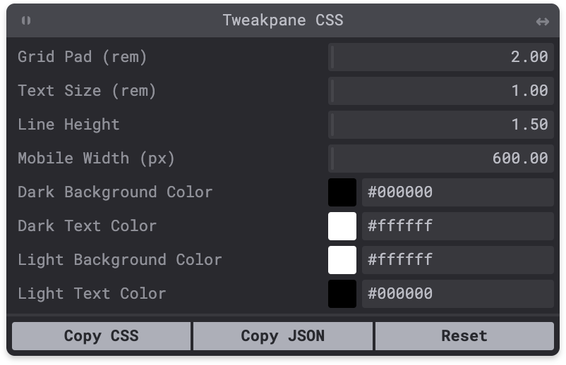

<!--+ Warning: Content inside HTML comment blocks was generated by mdat and may be overwritten. +-->

<!-- title -->

# tweakpane-css

<!-- /title -->

<!-- badges -->

[](https://npmjs.com/package/tweakpane-css)
[](https://opensource.org/licenses/MIT)

<!-- /badges -->

<!-- description -->

**Detect and tweak CSS variables at runtime.**

<!-- /description -->

## Overview

_Tweakpane CSS_ is a script that automatically detects and exposes your `:root` CSS variables in a [Tweakpane](https://tweakpane.github.io/docs/) interface for realtime manipulation during development.

For example, given the CSS below:

```css
:root {
  --grid-pad: 2rem;
  --text-size: 1rem;
  --line-height: 1.5;
  --mobile-width: 600px;
  --dark-background-color: #000000;
  --dark-text-color: #ffffff;
  --light-background-color: #ffffff;
  --light-text-color: #000000;
}
```

The following Tweakpane will be automatically generated and displayed over your page:



Changes to variables are applied immediately, and then persisted to local storage. Any variable changes are automatically applied across page refreshes.

The tweaked set of variables can be copied to the clipboard as CSS via the "Copy CSS" button.

The "Reset" button restores the variables to the original values specified in the css file, clearing local storage in the process.

The Tweakpane window has been augmented a bit to allow drag-based resizing and repositioning, and may be collapsed in the "window shade" tradition via a double-click on its title bar.

## Usage

For convenient integration and FOUC prevention, Tweakpane CSS is compiled down to a minified single-file IIFE. It's critical to use it as a classic script (no `defer`, no `module`).

You can add it to your project in three different ways:

### Locally

1. Install the package:

```sh
npm install --save-dev tweakpane-css
```

2. Add the script tag to the `head` of your template. Most casually, if you're only using Tweakpane CSS in local development, you can link right to the file in `node_modules`:

```html
<script src="main.js"></script>
```

More robust integration will depend on your framework / build tools / bundler, but again ensure that it is invoked as a classic script.

For example, in an Astro project, you have to add an `is:raw` to the script tag to prevent modularization:

```html
<script is:raw src="/node_modules/tweakpane-css/dist/main.js"></script>
```

### CDN

Add this script tag to the `head` of your template:

```html
<script src="https://cdn.jsdelivr.net/npm/tweakpane-css"></script>
```

### Bookmarklet

Create a bookmark with the url below:

```
javascript:(function(){var script=document.createElement('script');script.src='https://cdn.jsdelivr.net/npm/tweakpane-css';document.head.appendChild(script);})()
```

Note that the bookmarklet might not work with certain sites depending on their CSP.

The bookmarklet also has the disadvantage of not automatically loading across page reloads (though CSS values should persist and be restored once the bookmarklet is re-invoked).

### Component props

The underlying Svelte component that manages the Tweakpane CSS pane exposes properties for customization in advanced use cases:

#### `exclude`

An array of CSS custom property names that you would like Tweakpane CSS to completely ignore. This can be useful if you have certain properties which are controlled by media queries, for example.

```ts
export let exclude: string[]
```

The property names are normalized and case-insensitive, so you may write them with or without the `--` prefix.

#### `options`

Tweakpane CSS itself takes some configuration options:

```ts
export let options: {
  autoFolders?: boolean
  includeCalculated?: boolean
  prettyNames?: boolean
  showUnits?: boolean
  sortNames?: boolean
}
```

##### autoFolders

Organize properties into folders based on common name prefixes. (For example, `--text-light` and `--text-dark` would appear under the `Text` folder as `Light` and `Dark`)

##### includeCalculated

Whether to include properties with `calc(...)` in their values in Tweakpane CSS.

##### prettyNames

Whether to massage the property names into something a bit easier on the eyes. `--row-gap`, for example, would become `Row Gap`.

##### showUnits

Show CSS value units in a parenthetical next to the label.

##### sortNames

Sort the custom properties in alphabetic order, rather than the order they are found in the stylesheet.

### Passing props

Tweakpane CSS is normally used through an IIFE-compiled script, which by nature does not have the affordances for passing properties that we enjoy on proper components.

Instead, props may be passed via query parameters on the `src` url in the `<script>` tag where Tweakpane CSS is loaded.

The query parameters are parsed using [qs](https://github.com/ljharb/qs), which does its best to map human-friendly query strings to moderately complex property objects. The qs parser is configured with comma-separated arrays and dot notation for assigning object values, so a query string for the above properties might look like:

```plaintext
?exclude=some-unwanted-property&options.autoFolders=true&options.includeCalculated=true&options.sortNames=true
```

A simpler single-property exclusion, in the context of the IIFE `<script>` invocation, would look like:

```html
<script src="https://cdn.jsdelivr.net/npm/tweakpane-css?exclude=some-unwanted-property"></script>
```

## Dev Notes

Tweakpane CSS was written in [Svelte](https://svelte.dev) and leverages [svelte-tweakpane-ui](https://kitschpatrol.com/svelte-tweakpane-ui) for easy integration between Svelte and Tweakpane.

I created Tweakpane CSS for my own purposes, and it might not generalize well to other use-cases. If you'd like to see additional features or compatibility measures, please [open an issue](https://github.com/kitschpatrol/tweakpane-css/issues).

To fix: If multiple instances same page is running in a hidden tab, infinite loops of re-rendering can occur because of shared local storage.

## Acknowledgments

Thanks to [Hiroki Kokubun](https://cocopon.me) for the excellent Tweakpane library.

<!-- footer -->

## Contributing

[Issues](https://github.com/kitschpatrol/tweakpane-css/issues) and pull requests are welcome.

## License

[MIT](license.txt) © Eric Mika

<!-- /footer -->
