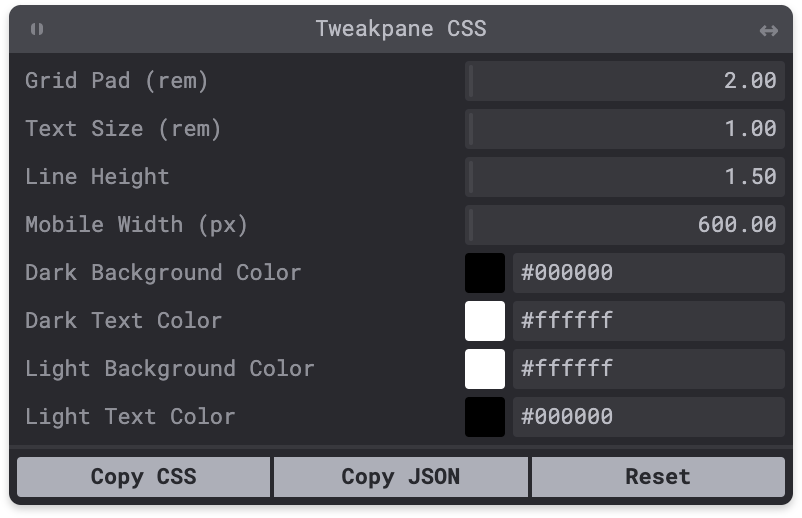

# tweakpane-css

<a href="https://npmjs.com/package/tweakpane-css"></a>

🚧 Work In Progress 🚧

## Overview

A [Svelte](https://svelte.dev) component that automatically detects and exposes your `:root` CSS variables in a [Tweakpane](https://cocopon.github.io/tweakpane/) interface for realtime manipulation during development.

For example, given the CSS below:

```css
:root {
  --grid-pad: 2rem;
  --text-size: 1rem;
  --line-height: 1.5;
  --mobile-width: 600px;
  --dark-background-color: #000000;
  --dark-text-color: #ffffff;
  --light-background-color: #ffffff;
  --light-text-color: #000000;
}
```

The following Tweakpane will be automatically generated and displayed over your page:



Changes to variables are applied immediately, and then persisted to local storage. Any variable changes are automatically applied across page refreshes.

The tweaked set of variables can be copied to the clipboard as CSS via the "Copy CSS" button.

The "Reset" button restores the variables to the original values specified in the css file, clearing local storage in the process.

The Tweakpane window has been augmented a bit to allow drag-based resizing and repositioning, and may be collapsed in the "window shade" tradition via a double-click on its title bar.

A separate [Astro](https://astro.build) component wrapper is included as well, since the component depends on adding an inline script to `<head>` to set overridden variables early during the page render to avoid flashes of the default values. Astro's Svelte integration does not currently support `<svelte:head>`.

## Usage

Currently, I'm only using this in Astro and Svelte projects that have their own build and bundling process — so there's not a stand-alone or vanilla JS option at this point.

### Installation

```shell
npm install tweakpane-css
```

### Svelte Integration

```html
<script lang="ts">
  import Tweakpane from 'tweakpane-css/src/Tweakpane.svelte'
</script>

<h1>Hello Tweakpane CSS</h1>
<Tweakpane />

<style>
  :global(:root) {
    --heading-color: #000000;
  }

  h1 {
    color: var(--heading-color);
  }
</style>
```

### Astro Integration

This might go in your `src/Layout/Base.astro`:

```html
---
import Tweakpane from 'tweakpane-css/src/Tweakpane.astro'
---

<!DOCTYPE html>
<html>
  <head>
    <!-- ... -->
  </head>
  <body>
    <slot />
    <Tweakpane />
  </body>
</html>

<style>
  :global(:root) {
    --background-color: #000000;
  }

  body {
    background: var(--background-color);
  }
</style>
```

## Acknowledgements

Thanks to [Hiroki Kokubun](https://cocopon.me) for the excellent Tweakpane library.

## Todo

- [ ] Vanilla JS build
- [ ] General clean up
- [ ] Peer dependencies
- [ ] Example projects
- [ ] Two-way binding / automatic refresh?
- [ ] Proper CSS parsing instead of regex for unit extraction
- [ ] Improved Tweakpane control style inference from CSS unit type
- [ ] Support for detecting variables on CSS selectors other than `:root`

## Dev Notes

Possible monorepo approach references:

- [Accessible Astro Components](https://github.com/markteekman/accessible-astro-components)
- [How to Make a Component That Supports Multiple Frameworks in a Monorepo](https://css-tricks.com/make-a-component-multiple-frameworks-in-a-monorepo/)
- [Monorepo Setup with NPM and TypeScript](https://plainenglish.io/blog/monorepo-setup-with-npm-and-typescript)

Componetized Tweakpane:

- [Svelte Tweakpane](https://github.com/pierogis/svelte-tweakpane)
